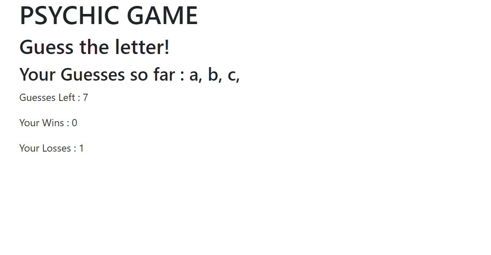
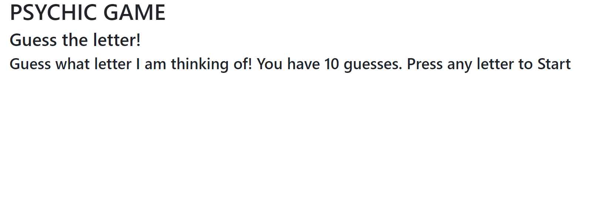
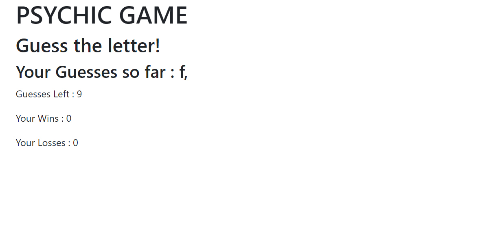
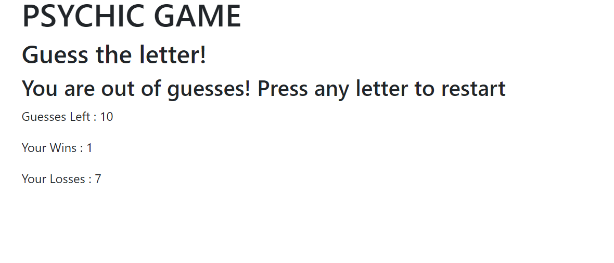

# Psychic-Game
a game of guessing the letter the AI has picked

#  WELCOME TO PSYCHIC GAME

This is game of guessing the letter the AI has picked. It runs on your browser.

HTML, JAVASCRIPT and CSS were used to set this up

## Snapshot of the webpage:

## Guide to this project:

* Step 1: Click on the link - https://arif2301.github.io/Psychic-Game/ to go to the webpage. Press your first guess to start the game

* Step 2: You have 10 guesses. Each guess is printed, along with guesses left

* Step 3: Your wins and losses get are tracked during each session, the game automatically restarts once completed.

Thank you for veiwing this project.
